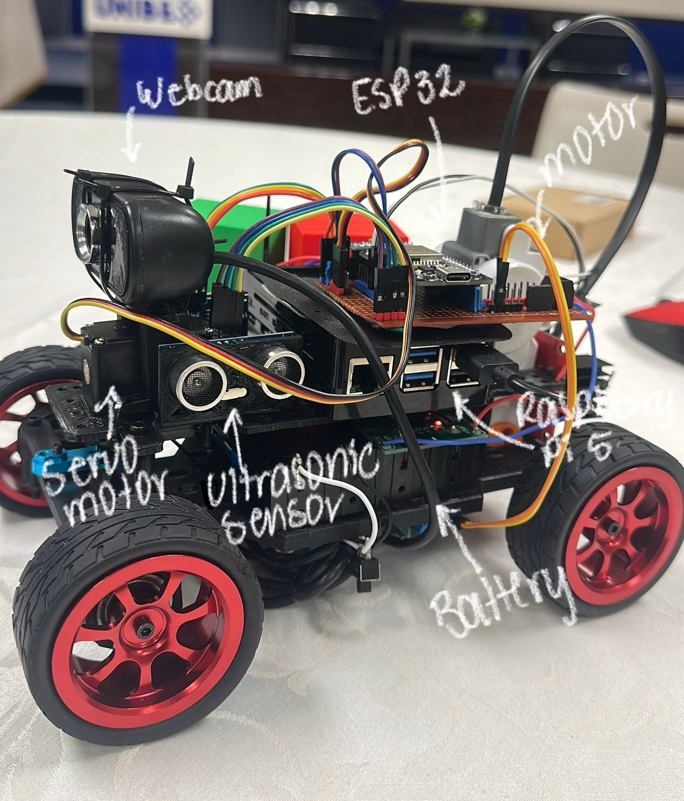
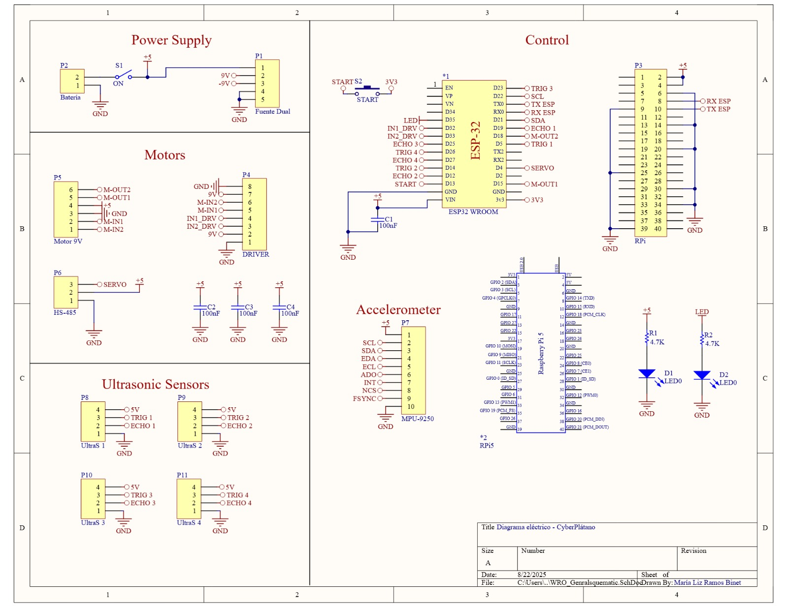

<center><h1> CyberPlátanoRD — WRO</center>

(logo)
                      
> Pontificia Universidad Católica Madre y Maestra (PUCMM), Dominican Republic • Future Engineers • 2025

---
<p align="center">
  <a href="https://www.youtube.com/@Ivan-lv9rn">
    
  </a>
</p>

## Engineering Documentation
This repository contains all documentation for the **CyberPlátanoRD** team's robot for the **Future Engineers category - World Robot Olympiad 2025**.  We document the development of our robot, from mechanical and electronic components to programming and simulation.

---
## Table of Contents
* [Introduction](#introduction)  
* [Repository Overview](#repository-overview)
* [About Us](#about-us)  
* [Mobility Management](#models)  
* [Power and Sense Management](#schemes)  
* [Obstacle/Open Managment](#src)

---------------------

##  Repository Overview
`models` - Files for models used by 3D printers to produce the vehicle elements.

`other` - Other essential files.

`schemes` - Schematic diagrams of the electromechanical components used in the vehicle and how they connect to each other.

`src` - contains code of control software for all components which were programmed to participate in the competition.

`t-photos` - 2 photos of the team.

`v-photos` - contains 6 photos of the vehicle (from every side, from top and bottom).

##  Introduction
This repository documents the journey of Cyberplátano RD, a team representing the Dominican Republic in the World Robot Olympiad (WRO) 2025 – Future Engineers Category, to be held in Singapore.

Our goal is to design, build, and program an autonomous robot car capable of completing the competition challenges: the Open Challenge and the Obstacle Challenge. The project integrates mechanical design, electronics, and software, combining skills from 3D printing, circuit design, and programming in C++ and Python.

By sharing our process through this repository, we aim to provide transparency in our work, create a detailed record of our engineering decisions, and contribute to the global robotics community. Every step, from materials and schematics to testing and results, is documented here.


##  Team Members
* Ivan Saint-Hilaire, ivanrma0702@gmail.com
* Brittany Martinez, martinezp.brtt@gmail.com
* Maria Ramos, ramosbinetm@gmail.com

## Hardware
### Materials List
| Name | Purpose  | Quantity | Price |
| ----------- | ----------- | ----------- |  ----------- |
| Raspberry Pi 5 | Main computer used for high-level processing   |  1  | $98.00    |
| ESP32 | Microcontroller responsible for real-time control of motors and sensors.|  1  | $10.00  |
| Motor Lego NXT | DC motor with encoder used for driving the wheels |  1  | $7.00  |
| NXT Lego Cable | Connects NXT motors and sensors to the control electronics. |  1  | $4.00 |
| 62mm Wheels | Provide traction and mobility to the robot. |  4  | $5.00 |
| H-Bridge (L298N) | Motor driver that allows bidirectional control of the DC motors, enabling forward and backward movement. |  1  | $2.50 |
| Webcam | Captures real-time video feed for visual processing |  1  | $20.00  |
| Servo Motor HS-485HB | Controls steering (front axle movement) or small actuations requiring angular precision. |  1  | $23.00 |
| Ultrasonic Sensor (HC-SR04) | Measures distance to nearby objects for obstacle detection and wall avoidance. |  3  | $4.50 each |
| MPU9250| Inertial Measurement Unit (IMU) that provides accelerometer, gyroscope, and magnetometer data for orientation and navigation. |  1  | $18.00 |
| Switch SPST 6A | Main power switch to safely turn the robot ON/OFF. |  1  | $0.50 |
| Push Button| Used as a start/stop input for robot operation. |  1  | $1.50 |
| Lego Motor Shaft | Mechanical part that transfers torque from the motor to the wheels/axle. |  1  | $0.10 |
| PLA Filament (Polylactic Acid) | Material used for 3D printing the chassis and custom parts of the robot due to its light weight and ease of printing. |  1  | $25.00 |

**Total Car Cost: $219.10US**

---

### Chasis & Mobility
The chassis is 3D-printed using black PLA filament, optimized for both light weight and structural strength. The frame includes pre-designed holes and channels to allow clean and secure wiring, reducing clutter and preventing loose cables from interfering with moving parts. 

- 4 × 65 mm wheels, with rear-wheel drive and front steering controlled by a servo.

- Heavy components (battery, drivers) are placed low and centered to improve stability.

### Motors & Drivers
The robot uses a hybrid actuation system that combines DC motors and servos to achieve both propulsion and precise steering. Propulsion is provided by a **Lego NXT DC** motor with an integrated encoder, which drives the rear wheels and supplies feedback for odometry, allowing the system to estimate both speed and distance traveled. The motor is controlled through an **L298N H-Bridge driver**, which enables bidirectional motion and PWM-based speed regulation. Although not the most power-efficient driver, the L298N was chosen for its reliability, simplicity, and compatibility with 5 V logic levels. Steering is handled by an HS-485HB servo motor mounted on the front axle. This servo provides accurate angular positioning, enabling the robot to perform precise maneuvers on the competition track. Torque is transmitted to the wheels using a custom Lego motor shaft, designed to be modular so that parts can be replaced quickly during testing or competition.


**Motor Lego NXT**	


**L298N H-Bridge**	


### Power & Wiring
Our robot uses **two separate battery packs**, each consisting of two 18650 Li-ion cells, to power different parts of the system and ensure stable operation.

- Battery Pack 1: Connected to a 5 V 3 A UPS. This pack powers the Raspberry Pi 5, providing uninterrupted power supply to handle high-level processing and computer vision tasks. The UPS ensures that the Pi stays powered even if the main battery momentarily drops or during short interruptions, which is critical during competition.

- Battery Pack 2: Connected to a XL4015 step-down voltage regulator set to 5 V. This pack supplies power to the ESP32, motors, and servo, delivering a stable voltage for real-time control of actuators and sensors. The regulated output ensures that PWM signals and sensor readings remain consistent and reliable.

The chassis is designed with pre-drilled holes and channels for cable management, keeping wires organized and preventing interference with moving parts. Both battery packs are mounted to maintain a low and centered center of gravity, improving stability. A SPST 6 A switch serves as the main power on/off control, and a push button is used to start or stop the robot’s programs.

This dual-battery system separates high-load electronics from control circuits, reducing voltage drops and improving overall reliability during testing and competition runs.

### Sensors

1. **Ultrasonic Sensor (HC-SR04)**  
- **How it works:** Sends out sound waves and measures how long they take to bounce back.  
- **What it does in our robot:**  
  - Detects walls and obstacles.  
  - Helps during the *Obstacle Challenge*.  
- **Connection:** Works with the ESP32 through digital pins (Trig and Echo).  
- **Power:** 5V.  


2. **IMU MPU-9250 (Accelerometer + Gyroscope + Magnetometer)**  

 - **How it works:** Combines accelerometer, gyroscope, and magnetometer data.  
- **What it does in our robot:**  
  - Measures tilt, rotation, and direction.  
  - Keeps the robot driving in a straight line.  
  - Helps smooth out turns.  
- **Connection:** Communicates with the ESP32 using I2C (SDA & SCL).  
- **Power:** 3.3V (Important: cannot be connected to 5V).  


3. **Webcam**  

- **How it works:** Captures images and sends them to the Raspberry Pi 5.  
- **What it does in our robot:**  
  - Detects lanes, colors, or markers.  
  - Allows real-time testing with visual feedback.  
- **Connection:** USB to Raspberry Pi 5.  
- **Power:** Powered by Raspberry Pi.  


---

## 3D Design
> CAD and STL files available in [models/](models/).


### Assembly


### Final Robot 
This folder represents the **reference design** for manufacturing and testing.  
 


This is the **second version of the CyberPlátanoRD robot** for WRO 2025.  
The final version is still under construction and will include several upgrades.


---

## Software
> CPP and Python codes files available in [src/](src/).

### Open challenge - Preview

Below is a short preview of the control logic used in our Open Challenge robot.  

The full version is available here  [`src/open_challengev2.ino`](./src/open_challengev2.ino)

```cpp
#include <Wire.h>
#include <MPU9250_asukiaaa.h>
#include <ESP32Servo.h>

MPU9250_asukiaaa mySensor;
Servo servoMotor;

// Basic yaw control variables
float yaw = 0.0;
float gyroZ_offset = 0.0;

void setup() {
  Serial.begin(115200);
  Wire.begin();
  mySensor.setWire(&Wire);
  mySensor.beginGyro();
  servoMotor.attach(18);
}

void loop() {
  mySensor.gyroUpdate();
  yaw += (mySensor.gyroZ() - gyroZ_offset) * 0.01;
  servoMotor.write(map((int)yaw % 360, 0, 360, 50, 130));
}

// ...rest of preview code...

```
---

### Obstacle challenge

---

## Schematics
> Diagrams and PCB Layout files available in [schemes/](schemes/).

### Diagram - Preview
[View full PDF](./schemes/WRO_Generalsquematic.pdf)



### PCB layout - Preview
[View full PCB Layout](./schemes/WRO_Generalpcblayout.pdf)


---

## Testing
The **"fogueos"** are an internal dynamic organized by the teams from PUCMM (Pontificia Universidad Católica Madre y Maestra), where participants from WRO Dominican Republic take part in friendly mini competitions.

The main goal is to test the robots under competition-like conditions, evaluate team performance, and share knowledge and improvements among teams.

Throughout this process, our team participated in several fogueos to enhance the robot’s precision, stability, and overall performance:

### "1st fogueo"
### "2nd fogueo"
### "3rd fogueo"
### "4th fogueo"
### "5th fogueo"
### "6th fogueo"
### "7th fogueo"
---

## Instructions
