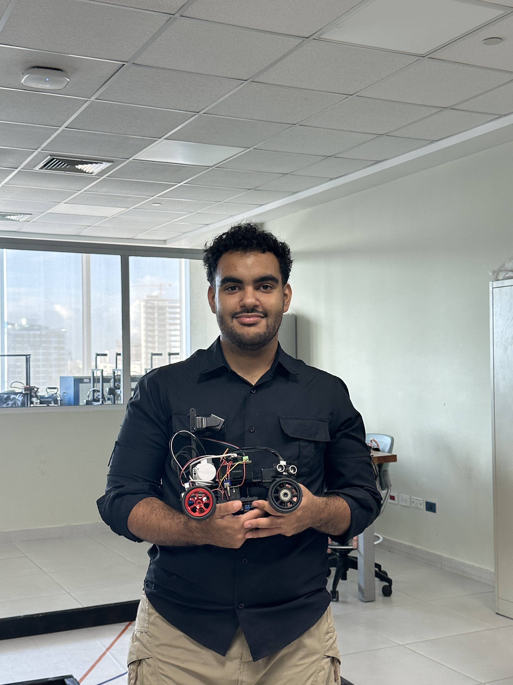
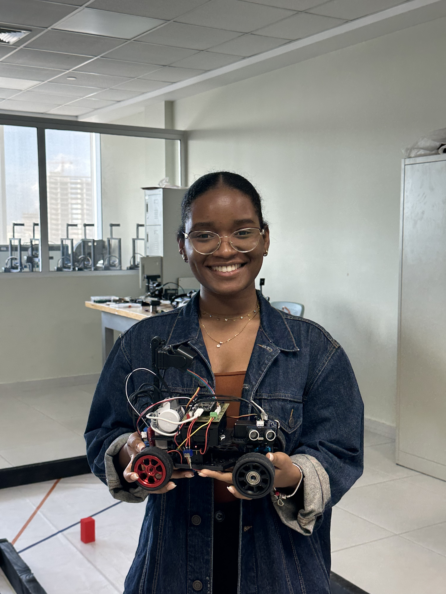
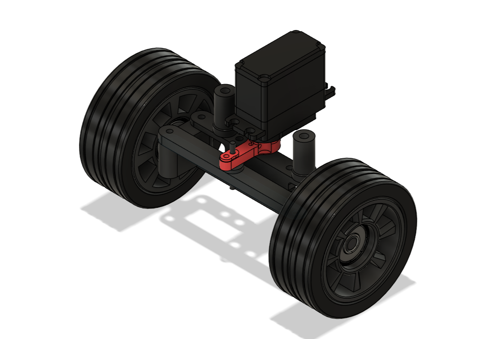

<h1 align="center">CyberPlátanoRD — WRO</h1>


> • Pontificia Universidad Católica Madre y Maestra (PUCMM), Dominican Republic • Future Engineers • 2025

---

<p align="center">
  <a href="https://www.youtube.com/@CyberPlatanoWRO">
    
  </a>
  <a href="https://www.instagram.com/pucmm?utm_source=ig_web_button_share_sheet&igsh=ZDNlZDc0MzIxNw==">
    
  </a>
</p>

---

# Engineering Documentation
This repository contains all documentation for the **CyberPlátanoRD** team's robot for the **Future Engineers category - World Robot Olympiad 2025**.  We document the development of our robot, from mechanical and electronic components to programming and simulation.


# Repository Overview

| Folder/File | Description |
|--------------|-------------|
| `models`     | Files for models used by 3D printers to produce the vehicle elements. |
| `other`      | Other essential files. |
| `schemes`    | Schematic diagrams of the electromechanical components used in the vehicle and how they connect to each other. |
| `src`        | Contains code of control software for all components which were programmed to participate in the competition. |
| `t-photos`   | Two photos of the team. |
| `v-photos`   | Contains six photos of the vehicle (from every side, from top and bottom). |

# Table of Contents
* [Introduction](#introduction)  
* [About Us](#part-1-about-us)
* [Mobility Management](#part-2-mobility-management)  
* [Power and Sense Management](#part-3-power-and-sense-management)  
* [Obstacle/Open Management](#part-4-obstacleopen-management)

---

# Introduction
This repository documents the journey of Cyberplátano RD, a team representing the Dominican Republic in the World Robot Olympiad (WRO) 2025 – Future Engineers Category, to be held in **Singapore**.

**Our goal** is to design, build, and program an autonomous robot car capable of completing the competition challenges: the Open Challenge and the Obstacle Challenge. The project integrates mechanical design, electronics, and software, combining skills from 3D printing, circuit design, and programming in C++ and Python.

By sharing our process through this repository, **we aim** to provide transparency in our work, create a detailed record of our engineering decisions, and contribute to the global robotics community. Every step, from materials and schematics to testing and results, is documented here.

## Documentation Video

---

# Part 1: About Us

## Our Team 
We are CyberPlátano, representing the Caribbean, Dominican Republic. Part of the PUCMM Robotics Club and guided by our mentor Álvaro Zapata, we are a group of young future engineers. Our club first competed in WRO 2023 in Panamá, and this year we continue our journey, bringing innovation, teamwork, and passion to the international stage in Singapore.

Our team consists of three Mechatronics Engineering students from  "Pontificia Universidad Católica Madre y Maestra (PUCMM)" currently in their third semester. We met during our studies and decided to collaborate as teammates, driven by our shared interest in robotics and innovation. Throughout our academic journey, we have gained valuable experience from our university projects and from the guidance of our professors and peers. This collaboration and learning process have led us to participate together on this international stage.

---

##  Team Members

#### 1. Ivan Saint-Hilaire - Software / Mechanical Eng. ####
| Photo | Role |
|-------|------|
|   | Iván is responsible for designing and optimizing the mechanical components of the robot while also developing and integrating the software that controls its functions. His expertise ensures that the robot operates efficiently, accurately, and reliably, bridging the gap between hardware and software.|


#### 2. Brittany Martinez - Team Coordinator and Document Designer  ####
| Photo | Role |
|-------|------|
|  | Brittany is responsible for documentation. She has skills in electronics and programming, which allow her to keep the team’s processes well organized. She also ensures that all procedures and systems the team works on are carried out accurately and correctly, maintaining a clear workflow.|

#### 3. Maria Liz Ramos  - Electronics Eng. ####
| Photo | Role |
|-------|------|
|   | María is responsible for designing, implementing, and maintaining the robot’s electronic systems, ensuring all sensors, circuits, and components function accurately and reliably for optimal performance in the competition.|

#### Alvaro Zapata  - Coach ####
| Photo | Role |
|-------|------|
|  | Alvaro is a Mechatronics Engineer, he mentors the team, providing technical guidance, strategic advice, and support to ensure the robot performs efficiently and the team works effectively.|

---

##  Work Schedule

This Gantt chart shows the planned timeline for the development of the WRO Future Engineers 2025 robot. It summarizes the main project phases—including design, mechanical build, electronics integration, software development, testing, and final optimization providing a clear view of deadlines and progress for each task.


---

# Part 2: Mobility Management
---
## Robot's Chassis 
Our robot’s chassis has been completely designed and developed from scratch, using Fusion 360 and 3D-printed in black PLA. The design philosophy is centered around modularity, balance, and accessibility, allowing easy modifications, component replacements, and upgrades throughout the development cycle.

We structured our chassis with three essential parts, each designed to provide both strength and modularity to the overall frame:

- **Main Base:** the central foundation that supports the main driving axis, ensuring precise alignment, rigidity, and stability for the entire chassis. 

- **Back Support**: provides mechanical rigidity and structural stability when handling torque or minor impacts. It connects the rear section of the chassis to the upper base and securely holds the drivetrain motor, maintaining alignment under load.

- **Upper Base:** holds the Raspberry Pi 5 and ESP32-CAM circuit, securing them in a stable and elevated position. It also locks the soldered board and supports the ultrasonic sensor mount, ensuring optimal positioning and cable organization.

- **Standoff:** connects the upper base and the main base, maintaining structural spacing and alignment between both layers. It provides rigidity and prevents vibrations from transferring between mechanical and electronic components.

Each element interlocks seamlessly, resulting in a lightweight yet durable frame. Cable management channels were integrated into the design to maintain a clean wiring layout and prevent interference with moving parts. The modular assembly also allows future versions to incorporate sensor mounts or additional mechanical features without redesigning the entire frame.

During the design process, special attention was given to:

- **Weight distribution**, ensuring the center of gravity remains low and centered.

- **Thermal management**, by maintaining airflow under the electronics.

- **Maintenance accessibility**, allowing any component to be removed within minutes.

All the 3D printable models can be found [here](#models).

---
## Robot's Steering System 
---
<p align="justify">
  
  Our robot's steering system was designed to provide precise and stable control of forward movement, ensuring the necessary maneuverability across different competition scenarios. We drew inspiration from <em>Ackermann steering system</em>, a configuration that allows a vehicle's front wheels to turn at different angles, enabling them to trace arcs with different radii during a turn. This prevents slipping and improves stability. The entire steering mechanism was developed and modeled in Fusion 360, prioritizing structural integration, modularity, and ease of maintenance. 
</p>

[Click here to view 3D model!](models/steering/steeringSTL.stl)

---
### Steering System Design
---
We took inspiration from a steering design previously developed by our coach, as well as several robotic systems found online. Building upon these references, we carried out an iterative improvement process to address issues related to tolerance, rigidity, and assembly accuracy inherent to 3D-printed components.

In our first prototype, the holes were designed with excessive tolerance, causing loose fits that affected the wheel hubs’ precision and stability. This led to misalignment and unwanted wheel play.

Throughout development, we produced **three main iterations** of the wheel hub design:

1. **First version:** It relied heavily on tight fitting between printed parts, making the design highly sensitive to printer tolerance variations. The wheels were not firmly secured and tended to detach during movement.
2. **Second version:** The fit dependency was reduced, and performance slightly improved; however, the vehicle’s axle and the hub’s axle were designed as separated parts within the same assembly. This made the system mechanically complex and caused lateral play in the wheels. Under repeated stress, the structure eventually fractured.
3. **Final version:** We decided to fully replace the tire rim with a 3D-printed one, which simplified the wheel-to-chassis connection and increased structural rigidity. We also incorporated design inspiration from other teams and opted to use **two 608ZZ bearings** instead of four, which effectively reduced lateral movement without sacrificing rotational smoothness.

Our final steering design combines rigidity, modularity, and precise control while maintaining the simplicity required for quick maintenance and adjustments during the competition.

The steering system consists of the following components:

| No. | Component | Description | Material / Specs |
|:---:|:-----------|:-------------|:----------------|
| 1 | **Under Column** | Lower support structure connecting wheel hubs and servo assembly. | PLA (3D printed), infill 20%, 0.2 mm layer height |
| 2 | **Upper Column** | Upper link supporting the servo and steering mechanism. | PLA, 20% infill, 0.2 mm |
| 3 | **StandOff 1 / 2** | Connect upper and lower columns maintaining alignment. | PLA, 20% infill |
| 4 | **Servo Hitec HS-485B** | Provides steering torque and precision control. | Torque 4.8 kg·cm 6V, 0.16 s/60° |
| 5 | **Bearings 608ZZ** | Enable smooth wheel rotation with minimal friction. | Ø22 mm × 7 mm |
| 6 | **Horn / Servo Arm** | Transmits motion from servo to steering link. | ABS (purchased from Amazon) |
| 7 | **Steering Link (Tie Rod)** | Connects both wheel hubs ensuring synchronized turning. | PLA, 30% infill |
| 8 | **Wheel Hubs** | Support the wheels and allow rotation through bearings. | PLA, 20% infill |
| 9 | **Steering Arm** | Intermediate printed lever that connects the servo horn to the steering link, transmitting motion. | PLA, 20% infill |

###  Steering Subassembly


### 1. Under and Upper Columns 


### 2. Stands Off 


### 3. Steering Arm


### 4. Frontal Rims 


---
### Our Key Steering Component: HS-485HB Servo Motor
---
Our primary steering component—the Hitec HS-485HB servo motor was initially chosen because it was the unit available to us at the time, extensive testing quickly proved it to be a reliable and well-suited choice for our steering system. Over more than three months of continuous use, the HS-485HB has demonstrated excellent consistency, durability, and torque stability, even under repetitive steering cycles and high-load maneuvers typical of competition environments. Its Karbonite gear train, known for increased wear resistance, has provided smooth motion transfer without backlash, and its response time has been fast enough to ensure accurate directional control on the field. What began as a practical selection evolved into a confident engineering decision, reinforced by the servo’s performance, structural robustness, and zero failure rate throughout our development process.

<table>
  <tr>
    <td align="center" width="450">
      
      <br>
      <b>HS-485HB Servo Motor</b>
    </td>
    <td>

| **Parameter**            | **Specification**                                   |
|-------------------------|-----------------------------------------------------|
| Servo type              | Standard, limited rotation (±60°)                   |
| Operating voltage       | 4.8 V – 6.0 V                                       |
| Torque                  | 4.8 kg·cm @ 4.8 V / 6.0 kg·cm @ 6.0 V               |
| Speed                   | 0.22 s/60° @ 4.8 V / 0.18 s/60° @ 6.0 V             |
| Gear material           | Karbonite (high wear resistance)                    |
| Bearing type            | Dual ball bearings                                  |
| Dimensions              | 39.8 × 19.8 × 38.0 mm                               |
| Weight                  | 45 g                                                |
| Output spline type      | 24T (Hitec)                                         |
| PWM signal range        | 900–2100 µs (typical)                               |
| Operating current       | ~160–200 mA (under moderate load)                   |
| Stall current           | Up to ~1.2 A (approx., depending on load)           |
| Case material           | Reinforced plastic                                  |
| Connector               | Futaba-type (3-pin)                                 |

  </td>
  </tr>
</table>

---
### Bill of Materials (BOM)
---
| **Component** | **Description** | **Qty** | **Unit Price (USD)** |
|----------------|------------------|----------|-----------------------|
| [Raspberry Pi 5](https://a.co/d/0I2nEqT) | Main computer used for high-level processing and running computer vision algorithms. | 1 | $98.00 |
| [ESP32](https://a.co/d/hiSPSgg) | Microcontroller responsible for real-time control of motors and sensors, communicating with the main processor. | 1 | $10.00 |
| [Motor Lego NXT](https://ebay.us/m/x9oEc6) | DC motor with encoder used for driving the wheels, providing precise speed and position feedback. | 1 | $7.00 |
| [NXT Lego Cable](https://ebay.us/m/tDWV4P) | Connects NXT motors and sensors to the control electronics. | 1 | $1.50 |
| [65mm Wheels](https://es.aliexpress.com/item/1005008744796805.html) | Provide traction and mobility to the robot. | 4 | $5.00 |
| [H-Bridge (L298N)](https://a.co/d/6sx6nvQ) | Motor driver that allows bidirectional control of the DC motors, enabling forward and backward movement. | 1 | $2.50 |
| [Creality Nebula Camera](https://a.co/d/1rddk0F) | Captures real-time video feed for visual processing, compatible with Raspberry Pi and AI-based image recognition. | 1 | $29.00 |
| [Servo Motor HS-485HB](https://a.co/d/8K9dx9H) | Controls steering (front axle movement) or small actuations requiring angular precision. | 1 | $19.00 |
| [Servo Motor Horn](https://a.co/d/hKtnZTU) | Mechanical arm attachment for the servo motor, transmits angular motion to the steering mechanism. | 1 | $9.00 |
| [Ultrasonic Sensor (HC-SR04)](https://a.co/d/gGVXDkd) | Measures distance to nearby objects for obstacle detection and wall avoidance. | 3 | $4.50 each |
| [MPU9250](https://a.co/d/abgbahF) | Inertial Measurement Unit (IMU) that provides accelerometer, gyroscope, and magnetometer data for orientation and navigation. | 1 | $17.00 |
| [Switch SPST 6A](https://a.co/d/7QAXuRy) | Main power switch to safely turn the robot ON/OFF. | 1 | $0.50 |
| [Push Button](https://a.co/d/fHT8FXe) | Used as a start/stop input for robot operation. | 1 | $1.50 |
| Lego Motor Shaft | Mechanical part that transfers torque from the motor to the wheels/axle. | 1 | $0.10 |
| [Dual Power Supply (DC-DC Boost)](https://es.aliexpress.com/item/1005007460824944.html) | Dual-output voltage regulator that steps up DC input to supply stable voltage levels to different modules. | 1 | $4.97 |
| [UPS Power Supply/Converter](https://es.aliexpress.com/item/1005005195434497.html) | Uninterruptible power supply module that maintains power delivery during voltage drops or disconnections. | 1 | $1.40 |
| [Bearings 608zz](https://a.co/d/b21FcTB) | Ball bearings used to reduce friction and support smooth wheel or axle rotation. | 2 | $0.20 |
| [Buck Converter XL4015](https://a.co/d/3TFsw20) | Step-down voltage regulator providing a stable 5V or 12V output for the control electronics. | 1 | $0.98 |
| [PLA Filament (Polylactic Acid)](https://a.co/d/bzdKSjG) | Material used for 3D printing the chassis and custom parts of the robot due to its light weight and ease of printing. | 1 | $25.00 |
| **Total Estimated Cost** |  |  | **$239.85** |

# Part 3: Power and Sense Management
---
This report presents the design, development, and integration of the electrical system implemented in the autonomous vehicle built for the WRO Future Engineers 2025 competition.

The main objective of the electrical subsystem was to provide a **reliable architecture for the robot’s power supply, sensing, processing, and actuation, ensuring stability, safety, and compatibility** with the challenge requirements, where the track changes dynamically in each round.

The system is based on an **ESP32 microcontroller**, responsible for managing the **ultrasonic sensors**, the **Creality Nebula Camera** for color recognition, and motor control. Power is supplied using 18650 lithium batteries, step-down regulators, a dual power source, and a custom PCB design to ensure proper power distribution and minimize interference caused by the motors.

Throughout the development process, tests were conducted on continuity, current consumption, sensor calibration, and digital communication validation. The main challenges included stabilizing the Raspberry Pi 5 power supply, mitigating electrical noise from the motors, dealing with the limited number of available pins, and unstable color readings, which led to several iterations in wiring, pin assignment, and signal filtering.

The results demonstrate that the electrical system met the minimum requirements for functional operation, enabling successful integration with the mechanical and control systems. Finally, potential improvements were identified, such as the implementation of encoders, sensor filtering optimization, and PCB refinement for future versions.

# Part 4: Obstacle/Open Management
> CPP and Python codes files available in [src/](src/).

### Open challenge - Preview

Below is a short preview of the control logic used in our Open Challenge robot.  

The full version is available here  [`src/open_challengev2.ino`](./src/open_challengev2.ino)

```cpp
#include <Wire.h>
#include <MPU9250_asukiaaa.h>
#include <ESP32Servo.h>

MPU9250_asukiaaa mySensor;
Servo servoMotor;

// Basic yaw control variables
float yaw = 0.0;
float gyroZ_offset = 0.0;

void setup() {
  Serial.begin(115200);
  Wire.begin();
  mySensor.setWire(&Wire);
  mySensor.beginGyro();
  servoMotor.attach(18);
}

void loop() {
  mySensor.gyroUpdate();
  yaw += (mySensor.gyroZ() - gyroZ_offset) * 0.01;
  servoMotor.write(map((int)yaw % 360, 0, 360, 50, 130));
}

// ...rest of preview code...

```
---

### Obstacle challenge

---

## Schematics
> Diagrams and PCB Layout files available in [schemes/](schemes/).

### Diagram - Preview
[View full PDF](./schemes/WRO_Generalsquematic.pdf)


### PCB layout - Preview
[View full PCB Layout](./schemes/WRO_Generalpcblayout.pdf)


---

## Testing
The **"fogueos"** are an internal dynamic organized by the teams from PUCMM (Pontificia Universidad Católica Madre y Maestra), where participants from WRO Dominican Republic take part in friendly mini competitions.

The main goal is to test the robots under competition-like conditions, evaluate team performance, and share knowledge and improvements among teams.

Throughout this process, our team participated in several fogueos to enhance the robot’s precision, stability, and overall performance:

### "1st fogueo"
### "2nd fogueo"
### "3rd fogueo"
### "4th fogueo"
### "5th fogueo"
### "6th fogueo"
### "7th fogueo"
---

## Instructions
